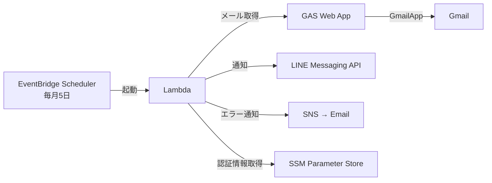

# money-meow

PayPayカードの確定メールから今月使えるお金を計算し、LINEに通知するアプリケーション。

## 計算式

```
(前月のクレカ確定金額) - 交通費(4万) + ゆうちょ(10万) + 楽天カード(10万) = 今月使えるお金
```

## アーキテクチャ



## ディレクトリ構成

```
./gas/           # GAS Web App (Gmail取得API)
./api/           # Lambda関数 (計算・LINE通知)
./infra/         # インフラ (AWS CDK)
./docs/          # GitHub Pages (プライバシーポリシー)
```

## セットアップ

### 1. GAS Web App のデプロイ

```bash
npm install
npx clasp login
cd gas
npx clasp create --title "money-meow" --type webapp
```

`.clasp.json` に `scriptId` が自動設定される。

```bash
cd .. && npm run gas:push
```

GAS エディタ（`npm run gas:open`）で:
1. `setupApiKey` を実行 → ログに API Key が表示される
2. デプロイ → 新しいデプロイ → ウェブアプリ
   - 次のユーザーとして実行: **自分**
   - アクセスできるユーザー: **全員**
3. デプロイ URL をメモ

### 2. LINE Messaging API 設定

1. [LINE Developers](https://developers.line.biz/) で Messaging API チャネルを作成
2. チャネルアクセストークンを発行
3. 自分の LINE ユーザーID を確認

### 3. ローカル動作確認

```bash
cp .env.example .env
# .env にクレデンシャルを記入

docker compose up
```

### 4. SSM パラメータ登録

```bash
aws ssm put-parameter --name "/money-meow/gas-url" --type SecureString --value "YOUR_GAS_URL" --overwrite
aws ssm put-parameter --name "/money-meow/gas-api-key" --type SecureString --value "YOUR_API_KEY" --overwrite
aws ssm put-parameter --name "/money-meow/line-channel-access-token" --type SecureString --value "YOUR_TOKEN" --overwrite
aws ssm put-parameter --name "/money-meow/line-user-id" --type SecureString --value "YOUR_USER_ID" --overwrite
```

### 5. 本番デプロイ

```bash
cd infra
npm install
npx cdk bootstrap  # 初回のみ
npx cdk deploy
```

## 手動実行（デプロイ後）

```bash
aws lambda invoke --function-name money-meow-gmail-fetcher /dev/stdout
```

## GAS API エンドポイント

| アクション | URL |
|---|---|
| 最新の請求金額 | `GAS_URL?key=API_KEY&action=latest` |
| 過去の請求履歴 | `GAS_URL?key=API_KEY&action=history&months=6` |

## 設定変更

`api/src/config.ts` の値を変更してデプロイ：

| 項目 | デフォルト値 | 説明 |
|------|-------------|------|
| `TRANSPORTATION_COST` | 40,000 | 交通費 |
| `YUCHO_AMOUNT` | 100,000 | ゆうちょ口座からの金額 |
| `RAKUTEN_AMOUNT` | 100,000 | 楽天カードからの金額 |
| `EMAIL_SEARCH_QUERY` | `subject:の請求予定金額のお知らせ newer_than:10d` | Gmail検索クエリ |
