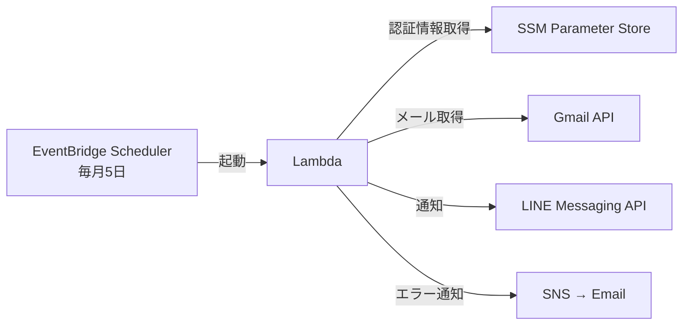

# money-meow

PayPayカードの確定メールからGmail APIで請求金額を取得し、今月使えるお金を計算してLINEに通知するアプリケーション。

## 計算式

```
(前月のクレカ確定金額) - 交通費(4万) + ゆうちょ(10万) + 楽天カード(10万) = 今月使えるお金
```

## アーキテクチャ



## ディレクトリ構成

```
./api/          # Lambda関数 (TypeScript)
./infra/        # インフラ (AWS CDK)
./scripts/      # OAuth認可スクリプト
```

## セットアップ

### 1. Google Cloud Console 設定

1. [Google Cloud Console](https://console.cloud.google.com/) でプロジェクト作成
2. Gmail API を有効化
3. OAuth 同意画面を設定:
   - ユーザータイプ: **外部**
   - スコープ: `gmail.readonly` を追加
   - テストユーザー: `homing0321r4cfw@gmail.com` を追加
   - **「本番に公開」をクリック**（テストのままだとリフレッシュトークンが7日で失効する）
4. 認証情報 → OAuth 2.0 クライアント ID を作成（種類: **デスクトップアプリ**）
5. クライアントID とクライアントシークレットをメモ

### 2. LINE Messaging API 設定

1. [LINE Developers](https://developers.line.biz/) で Messaging API チャネルを作成
2. チャネルアクセストークンを発行
3. 自分の LINE ユーザーID を確認

### 3. リフレッシュトークン取得（一度だけ）

```bash
cd api && npm install && cd ..

GOOGLE_CLIENT_ID=xxx GOOGLE_CLIENT_SECRET=xxx npx tsx scripts/get-refresh-token.ts
```

表示されたURLをブラウザで開き、認可を完了する。ターミナルにリフレッシュトークンが表示される。

### 4. SSM パラメータ登録

```bash
aws ssm put-parameter --name "/money-meow/google-client-id" --type SecureString --value "YOUR_CLIENT_ID" --overwrite
aws ssm put-parameter --name "/money-meow/google-client-secret" --type SecureString --value "YOUR_CLIENT_SECRET" --overwrite
aws ssm put-parameter --name "/money-meow/google-refresh-token" --type SecureString --value "YOUR_REFRESH_TOKEN" --overwrite
aws ssm put-parameter --name "/money-meow/line-channel-access-token" --type SecureString --value "YOUR_TOKEN" --overwrite
aws ssm put-parameter --name "/money-meow/line-user-id" --type SecureString --value "YOUR_USER_ID" --overwrite
```

### 5. ローカル動作確認

```bash
cp .env.example .env
# .env にクレデンシャルを記入

docker compose up
```

### 6. 本番デプロイ

```bash
cd infra
npm install
npx cdk bootstrap  # 初回のみ
npx cdk deploy
```

SNS のメール確認メールが届くので、承認する。

## 手動実行（デプロイ後）

```bash
aws lambda invoke --function-name money-meow-gmail-fetcher /dev/stdout
```

## トークンが失効した場合

SNS 経由でメール通知が届く。以下を実行して再認可：

```bash
GOOGLE_CLIENT_ID=xxx GOOGLE_CLIENT_SECRET=xxx npx tsx scripts/get-refresh-token.ts
# 表示されたコマンドで SSM を更新
```

## 設定変更

`api/src/config.ts` の値を変更してデプロイ：

| 項目 | デフォルト値 | 説明 |
|------|-------------|------|
| `TRANSPORTATION_COST` | 40,000 | 交通費 |
| `YUCHO_AMOUNT` | 100,000 | ゆうちょ口座からの金額 |
| `RAKUTEN_AMOUNT` | 100,000 | 楽天カードからの金額 |
| `EMAIL_SEARCH_QUERY` | `subject:の請求予定金額のお知らせ newer_than:10d` | Gmail検索クエリ |
